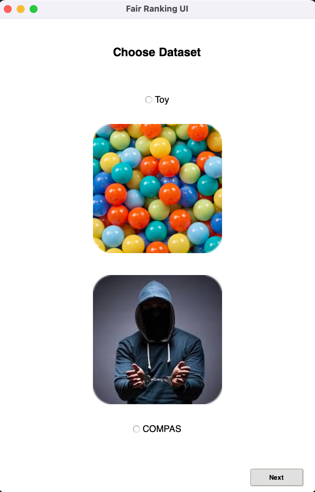

# Fair-Ranking-Project

## 1. Background

Fair ranking is the process of ordering items so that the final ranked list is not only high-quality in terms of relevance but also equitable. In many real-world applications—such as college admissions, credit scoring, and criminal risk assessment—the ranking process can unintentionally perpetuate historical biases. Fair ranking methods are designed to mitigate such biases by ensuring that protected groups receive fair representation in the top-ranked results.

This project implements fair ranking using the 2DarraySweep and 2DOnline algorithms, supports both a toy dataset and the COMPAS dataset, and applies a fairness model (FM1) that ensures a balanced representation of protected groups. The UI is built using Tkinter with a modern theme, and users can interact with the system by following the simple on-screen instructions.
## 2. Algorithms

### 2DarraySweep

The **2DarraySweep** algorithm handles the two-dimensional case where each item is represented by two scoring attributes. It works by:
- **Initializing an ordering:** Sorting the items based on one attribute.
- **Computing ordering exchanges:** Identifying points where two adjacent items would swap their order as the scoring function is varied.
- **Processing these exchanges using a min-heap:** The algorithm swaps items as their order changes and updates the heap with new events.
  
Its overall complexity is approximately $O(n^2 \log n + \Upsilon(n))$, where $\Upsilon(n)$ represents the complexity of the fairness check.

### 2DOnline

The **2DOnline** algorithm is designed for the interactive phase. Given a user’s proposed scoring function, it:
- **Converts the weight vector to polar coordinates.**
- **Uses binary search** on a precomputed sorted list of satisfactory regions to determine if the current function meets fairness constraints.
- **Returns the function directly or the nearest modified version** that satisfies fairness.

This algorithm operates in $O(\log n)$ per query, making it efficient for interactive use.

## 3. Datasets

### Toy Dataset

The toy dataset is a basic set taken from the original paper, used primarily for debugging. It contains 5 data points, each labeled in blue or orange. The objective is to rank the items while maintaining an equal number of blue and orange labels in the top 4 positions.

### COMPAS Dataset

The COMPAS dataset is used for more advanced experiments in fair ranking. Originally collected and published by ProPublica, this dataset was part of an investigation into potential biases in criminal risk assessment software. It contains detailed information about individuals, including demographics, recidivism scores, and various criminal offense indicators. This richness makes it a challenging and realistic dataset for studying fairness in ranking systems.

Its key attributes are:

- **SCORING_ATTR:**  
  `['c_days_from_compas', 'juv_other_count', 'days_b_screening_arrest', 'start', 'end', 'age', 'priors_count']`
  
- **TYPE_ATTS:**  
  ```python
  {
      'sex': ['Male', 'Female'],
      'age_binary': ['<36', '>=36'],
      'age_bucketized': ['<30', '31-40', '>40'],
      'race': ['African-American', 'Caucasian', 'Hispanic', 'Asian', 'Native American', 'Other']
  }

## 4. Fairness
The fairness model implemented, referred to as FM1, ensures that the top-K ranking contains a balanced representation of the protected group. In our implementation, we check that in the top 30% of the ranking, the protected type (for example, race) does not exceed 60% of the total. This threshold is configurable in the code. FM1 is inspired by fairness constraints in recent literature and aims to achieve an equitable ranking outcome.

## 5. How to Run



To run the implementation, simply execute the `main.py` file from the project root:

```bash
    python main.py
```
  
Follow the on-screen UI instructions to:
* Select the dataset: Choose either the Toy dataset or the COMPAS dataset.
* For COMPAS: Choose the desired scoring attributes and protected type options.
* Interact with the UI: The interface guides you through each step, including the online phase for fair ranking adjustments.

- **Experiment Option:**  
  There is an option to run an experiment that replicates the study presented in Figure 14 of the paper. When enabled, the experiment evaluates the performance of the 2DarraySweep preprocessing algorithm as the dataset size increases. It measures:
  - The runtime performance (in seconds) of the algorithm.
  - The number of ordering exchanges computed during preprocessing.

  This experiment demonstrates that, despite the theoretical worst-case complexity, the actual performance is much more efficient. You can enable the experiment via the "Run experiment" checkbox in the COMPAS section of the UI.


## 6. Dependencies
This project requires the following Python libraries:
* pandas
* matplotlib
* Pillow (PIL)
* tkinter (usually included with Python)

You can install the required packages using pip:
```bash
    pip install pandas matplotlib pillow
```

